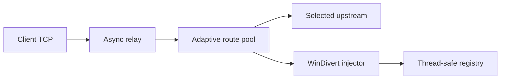

# SNI-Spoofing

یک TCP relay آزمایشی برای ویندوز که با WinDivert روی handshake اتصال خروجی کار می‌کند. این شاخه روی **پایداری، کارایی و fail-safe بودن** تمرکز دارد؛ هرگونه استفاده باید روی شبکه و سامانه‌ای باشد که مجوز تست آن را دارید.

> وضعیت پروژه: Experimental — هنوز برای استقرار عمومی بدون مانیتورینگ و تست میدانی توصیه نمی‌شود.

## تغییرات نسخه Hardened Core

- رفع باگ بحرانی `asyncio.sock_sendall()` که Relay را بعد از اولین ارسال می‌بست
- حذف `sys.exit()` از مسیر پردازش اتصال و Packet
- Registry قفل‌دار بین Event Loop و Thread مربوط به WinDivert
- یک Scheduler مشترک برای Packetهای تأخیردار به‌جای Thread جدا برای هر اتصال
- محدودیت تعداد اتصال سراسری و به‌ازای هر IP
- timeout مستقل برای اتصال، Injection و Idle connection
- cleanup قطعی Socket و Connection در همه مسیرهای خطا
- اعتبارسنجی کامل `config.json` قبل از اجرای Driver
- لاگ استاندارد و بدون ثبت Payload کاربران
- Route pool تطبیقی با failover، least-loaded selection و circuit breaker
- Routeهای صریح برای جفت‌کردن دقیق هر Upstream با Decoy SNI خودش
- حفظ سازگاری با تنظیمات قدیمی چند Upstream و چند Decoy SNI
- انتخاب مسیر با EWMA latency، exploration دوره‌ای و امتیاز reliability/load
- cooldown نمایی برای جلوگیری از retry storm هنگام قطعی مسیر
- تشخیص source interface مجزا برای هر Upstream و ساخت فیلتر دقیق WinDivert
- graceful drain اتصال‌های فعال هنگام خاموش‌شدن برنامه
- بررسی Config و Route بدون بالا آوردن Driver با `--check-config`
- Client CIDR allowlist و metricهای تجمیعی بدون Payload یا IP کاربر
- تست Regression و CI ویندوز روی Python 3.10 تا 3.13

## پیش‌نیازها

- Windows 10/11 x64
- Python 3.10 یا جدیدتر
- دسترسی Administrator برای WinDivert

```powershell
py -m venv .venv
.\.venv\Scripts\Activate.ps1
py -m pip install -r requirements.txt
py main.py
```

## تنظیمات

فایل پیش‌فرض عمداً `LISTEN_HOST` را روی `0.0.0.0` نگه می‌دارد:

```json
{
  "LISTEN_HOST": "0.0.0.0",
  "LISTEN_PORT": 40443,
  "ALLOWED_CLIENT_CIDRS": ["0.0.0.0/0"],
  "ROUTES": [
    {"IP": "188.114.98.0", "PORT": 443, "FAKE_SNI": "aparat.com"}
  ],
  "BYPASS_METHOD": "wrong_seq",
  "CONNECT_TIMEOUT_SECONDS": 5,
  "INJECTION_TIMEOUT_SECONDS": 2,
  "IDLE_TIMEOUT_SECONDS": 180,
  "SHUTDOWN_GRACE_SECONDS": 30,
  "MAX_ROUTE_ATTEMPTS": 3,
  "ROUTE_FAILURE_THRESHOLD": 2,
  "ROUTE_COOLDOWN_SECONDS": 30,
  "ROUTE_MAX_COOLDOWN_SECONDS": 300,
  "ROUTE_LATENCY_ALPHA": 0.2,
  "ROUTE_EXPLORATION_INTERVAL": 16,
  "METRICS_INTERVAL_SECONDS": 60,
  "RELAY_BUFFER_SIZE": 131072,
  "MAX_CONNECTIONS": 2048,
  "MAX_CONNECTIONS_PER_IP": 64,
  "LISTEN_BACKLOG": 1024,
  "LOG_LEVEL": "INFO"
}
```

هر عضو `ROUTES` یک پروفایل مستقل و قطعی است؛ یعنی `IP`، `PORT` و `FAKE_SNI` فقط با همان جفت استفاده می‌شوند. این مدل برای چند Endpoint جلوی ترکیب ناخواسته‌ی SNI یک Route با IP مسیر دیگر را می‌گیرد.

تنظیمات قدیمی `CONNECT_IP`/`CONNECT_PORT`/`FAKE_SNI` و همچنین `UPSTREAMS`/`FAKE_SNIS` همچنان پشتیبانی می‌شوند. در مدل قدیمی، برنامه برای سازگاری از ضرب دکارتی Upstreamها و SNIها Route می‌سازد. `ROUTES` را نباید هم‌زمان با کلیدهای قدیمی استفاده کنید.

قبل از اجرا می‌توانید Config، Routeهای مقصد و source interface انتخاب‌شده توسط سیستم‌عامل را بدون راه‌اندازی WinDivert بررسی کنید:

```powershell
py main.py --check-config
py main.py --config C:\SNI-Spoofing\config.json --check-config
```

### Failover تطبیقی

انتخاب بین اعضای `ROUTES` با ترکیب تعداد اتصال فعال، EWMA زمان connect/injection و نرخ موفقیت انجام می‌شود. یک exploration کنترل‌شده هم مانع starvation مسیرهای کم‌استفاده می‌شود.

خطاهای اتصال یا Injection به‌صورت passive ثبت می‌شوند. بعد از `ROUTE_FAILURE_THRESHOLD` شکست متوالی، circuit مسیر باز می‌شود. cooldown از `ROUTE_COOLDOWN_SECONDS` شروع می‌شود و در شکست‌های half-open تا سقف `ROUTE_MAX_COOLDOWN_SECONDS` به‌صورت نمایی افزایش پیدا می‌کند. وقتی همه مسیرها در cooldown هستند، اتصال fail-fast می‌شود تا retry storm ایجاد نشود. هر Client حداکثر `MAX_ROUTE_ATTEMPTS` مسیر متفاوت را امتحان می‌کند.

برای failover واقعی باید حداقل دو Route معتبر و تست‌شده داشته باشید. تنظیم پیش‌فرض فقط یک Route دارد و طبیعتاً مسیر جایگزین ایجاد نمی‌کند. IP تصادفی Cloudflare اضافه نکنید؛ هر Upstream باید واقعاً سرویس مقصد شما را terminate کند.

برای سیستم‌های چند NIC، VPN یا چند default route، source IPv4 هر Upstream جداگانه از جدول Route ویندوز تشخیص داده می‌شود. Socket خروجی و clause متناظر WinDivert دقیقاً از همان interface استفاده می‌کنند.

هنگام توقف برنامه، Listener بلافاصله بسته می‌شود اما اتصال‌های در حال عبور تا `SHUTDOWN_GRACE_SECONDS` فرصت تکمیل دارند؛ بعد از آن فقط کارهای باقی‌مانده لغو و Socketهایشان پاک‌سازی می‌شوند. مقدار `0` خاموش‌شدن فوری را فعال می‌کند.

### نکته مهم درباره Aparat و Cloudflare

`aparat.com` در این تنظیمات فقط **Decoy SNI داخل ClientHello جعلی** است. این دامنه IP تمیز Cloudflare نیست و مالکیت یا ارتباطی با این پروژه ندارد. مقصد TCP از `ROUTES[].IP` انتخاب می‌شود. برای تشخیص Cloudflare بودن IP فقط از [فهرست رسمی IPهای Cloudflare](https://www.cloudflare.com/ips/) استفاده کنید.

این برنامه به‌تنهایی VPN یا اینترنت عمومی ایجاد نمی‌کند؛ یک TCP relay به Endpointهای مشخص است. برای دسترسی عمومی، Endpoint انتخابی باید Backend مجاز و واقعی Tunnel/Proxy شما را ارائه کند. Decoy SNI جای Backend را نمی‌گیرد.

### هشدار Listener عمومی

گوش‌دادن روی `0.0.0.0` یعنی پورت روی همه Interfaceها باز می‌شود. حتی با وجود محدودیت داخلی، در محیط عملیاتی باید پورت `40443/TCP` را در Firewall فقط برای IP/CIDR کاربران مجاز Allow کنید.

`ALLOWED_CLIENT_CIDRS` یک لایه Admission داخل برنامه است. مقدار پیش‌فرض `0.0.0.0/0` برای حفظ رفتار قبلی همه را مجاز می‌کند و **Open Listener** است؛ برای Production آن را با CIDRهای واقعی کاربران یا شبکه‌ی ورودی عوض کنید. این کنترل جای احراز هویت لایه Tunnel یا Firewall را نمی‌گیرد.

نمونه محدودسازی:

```json
{
  "ALLOWED_CLIENT_CIDRS": [
    "198.51.100.24/32",
    "203.0.113.0/28"
  ]
}
```

هر `METRICS_INTERVAL_SECONDS` ثانیه یک رکورد `gateway_metrics` در Log نوشته می‌شود: تعداد اتصال فعال/پذیرفته/ردشده و وضعیت هر Route شامل success، failure، cooldown و EWMA latency. Payload، SNI واقعی کاربر یا IP Client در این رکورد ذخیره نمی‌شود. مقدار `0` گزارش دوره‌ای را غیرفعال می‌کند.

## تست توسعه

CI فعلاً برای کنترل مصرف GitHub Actions فقط به‌صورت دستی (`workflow_dispatch`) اجرا می‌شود. تا قبل از فعال‌سازی دوباره، تست‌های زیر باید قبل از هر Commit به‌صورت محلی اجرا شوند.

```powershell
py -m pip install -r requirements.txt -r requirements-dev.txt
py -m ruff check .
py -m ruff format --check .
py -m compileall -q .
py -m unittest discover -s tests -v
```

## معماری فعلی



## مسیر توسعه

1. تست میدانی کنترل‌شده و ثبت فقط Metricهای غیرشخصی
2. Metricهای محلی برای نرخ موفقیت، latency و cooldown هر Route
3. Windows Service و Release امضاشده
4. جداسازی Data Plane برای پیاده‌سازی سریع‌تر و چندسکویی
5. Backend مستقل برای Linux/OpenWrt و Android

## حمایت و ارتباط

- Telegram: [projectXhttp](https://t.me/projectXhttp)
- Telegram: [patterniha](https://t.me/patterniha)
- USDT (BEP20): `0x76a768B53Ca77B43086946315f0BDF21156bF424`
- USDT (TRC20): `TU5gKvKqcXPn8itp1DouBCwcqGHMemBm8o`
