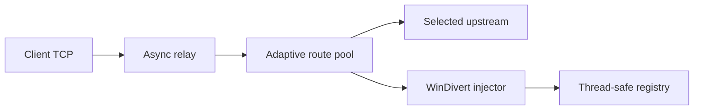

# SNI-Spoofing

یک TCP relay آزمایشی برای ویندوز که با WinDivert روی handshake اتصال خروجی کار می‌کند. این شاخه روی **پایداری، کارایی و fail-safe بودن** تمرکز دارد؛ هرگونه استفاده باید روی شبکه و سامانه‌ای باشد که مجوز تست آن را دارید.

> وضعیت پروژه: Experimental — هنوز برای استقرار عمومی بدون مانیتورینگ و تست میدانی توصیه نمی‌شود.

## تغییرات نسخه Hardened Core

- رفع باگ بحرانی `asyncio.sock_sendall()` که Relay را بعد از اولین ارسال می‌بست
- حذف `sys.exit()` از مسیر پردازش اتصال و Packet
- Registry قفل‌دار بین Event Loop و Thread مربوط به WinDivert
- یک Scheduler مشترک برای Packetهای تأخیردار به‌جای Thread جدا برای هر اتصال
- محدودیت تعداد اتصال سراسری و به‌ازای هر IP
- timeout مستقل برای اتصال، Injection و Idle connection
- cleanup قطعی Socket و Connection در همه مسیرهای خطا
- اعتبارسنجی کامل `config.json` قبل از اجرای Driver
- لاگ استاندارد و بدون ثبت Payload کاربران
- Route pool تطبیقی با failover، least-loaded selection و circuit breaker
- پشتیبانی از چند Upstream و چند Decoy SNI با حفظ تنظیمات قدیمی
- تست Regression و CI ویندوز روی Python 3.10 تا 3.13

## پیش‌نیازها

- Windows 10/11 x64
- Python 3.10 یا جدیدتر
- دسترسی Administrator برای WinDivert

```powershell
py -m venv .venv
.\.venv\Scripts\Activate.ps1
py -m pip install -r requirements.txt
py main.py
```

## تنظیمات

فایل پیش‌فرض عمداً `LISTEN_HOST` را روی `0.0.0.0` نگه می‌دارد:

```json
{
  "LISTEN_HOST": "0.0.0.0",
  "LISTEN_PORT": 40443,
  "UPSTREAMS": [
    {"IP": "188.114.98.0", "PORT": 443}
  ],
  "FAKE_SNIS": ["aparat.com"],
  "BYPASS_METHOD": "wrong_seq",
  "CONNECT_TIMEOUT_SECONDS": 5,
  "INJECTION_TIMEOUT_SECONDS": 2,
  "IDLE_TIMEOUT_SECONDS": 180,
  "MAX_ROUTE_ATTEMPTS": 3,
  "ROUTE_FAILURE_THRESHOLD": 2,
  "ROUTE_COOLDOWN_SECONDS": 30,
  "RELAY_BUFFER_SIZE": 131072,
  "MAX_CONNECTIONS": 2048,
  "MAX_CONNECTIONS_PER_IP": 64,
  "LISTEN_BACKLOG": 1024,
  "LOG_LEVEL": "INFO"
}
```

تنظیمات قدیمی `CONNECT_IP` و `CONNECT_PORT` همچنان پشتیبانی می‌شوند. وقتی `UPSTREAMS` وجود داشته باشد، مسیرهای جدید از آن ساخته می‌شوند.

### Failover تطبیقی

برنامه از ترکیب هر عضو `UPSTREAMS` با هر عضو `FAKE_SNIS` یک Route Profile می‌سازد. انتخاب مسیر به‌شکل round-robin بین کم‌بارترین مسیرهای سالم انجام می‌شود. خطاهای اتصال یا Injection به‌صورت passive ثبت می‌شوند و بعد از `ROUTE_FAILURE_THRESHOLD` شکست متوالی، مسیر برای `ROUTE_COOLDOWN_SECONDS` وارد cooldown می‌شود. هر اتصال جدید حداکثر `MAX_ROUTE_ATTEMPTS` مسیر متفاوت را قبل از بستن Client امتحان می‌کند.

برای failover واقعی باید حداقل دو Endpoint معتبر یا دو پروفایل تست‌شده داشته باشید. تنظیم پیش‌فرض فقط یک Upstream و یک SNI دارد و طبیعتاً مسیر جایگزین ایجاد نمی‌کند. IP تصادفی Cloudflare اضافه نکنید؛ هر Upstream باید واقعاً سرویس مقصد شما را terminate کند.

### نکته مهم درباره Aparat و Cloudflare

`aparat.com` در این تنظیمات فقط **Decoy SNI داخل ClientHello جعلی** است. این دامنه IP تمیز Cloudflare نیست و مالکیت یا ارتباطی با این پروژه ندارد. مقصد TCP از `UPSTREAMS` انتخاب می‌شود. برای تشخیص Cloudflare بودن IP فقط از [فهرست رسمی IPهای Cloudflare](https://www.cloudflare.com/ips/) استفاده کنید.

این برنامه به‌تنهایی VPN یا اینترنت عمومی ایجاد نمی‌کند؛ یک TCP relay به Endpointهای مشخص است. برای دسترسی عمومی، Endpoint انتخابی باید Backend مجاز و واقعی Tunnel/Proxy شما را ارائه کند. Decoy SNI جای Backend را نمی‌گیرد.

### هشدار Listener عمومی

گوش‌دادن روی `0.0.0.0` یعنی پورت روی همه Interfaceها باز می‌شود. حتی با وجود محدودیت داخلی، در محیط عملیاتی باید پورت `40443/TCP` را در Firewall فقط برای IP/CIDR کاربران مجاز Allow کنید.

## تست توسعه

```powershell
py -m pip install -r requirements.txt -r requirements-dev.txt
py -m ruff check .
py -m ruff format --check .
py -m compileall -q .
py -m unittest discover -s tests -v
```

## معماری فعلی



## مسیر توسعه

1. تست میدانی کنترل‌شده و ثبت فقط Metricهای غیرشخصی
2. Metricهای محلی برای نرخ موفقیت، latency و cooldown هر Route
3. Windows Service و Release امضاشده
4. جداسازی Data Plane برای پیاده‌سازی سریع‌تر و چندسکویی
5. Backend مستقل برای Linux/OpenWrt و Android

## حمایت و ارتباط

- Telegram: [projectXhttp](https://t.me/projectXhttp)
- Telegram: [patterniha](https://t.me/patterniha)
- USDT (BEP20): `0x76a768B53Ca77B43086946315f0BDF21156bF424`
- USDT (TRC20): `TU5gKvKqcXPn8itp1DouBCwcqGHMemBm8o`
